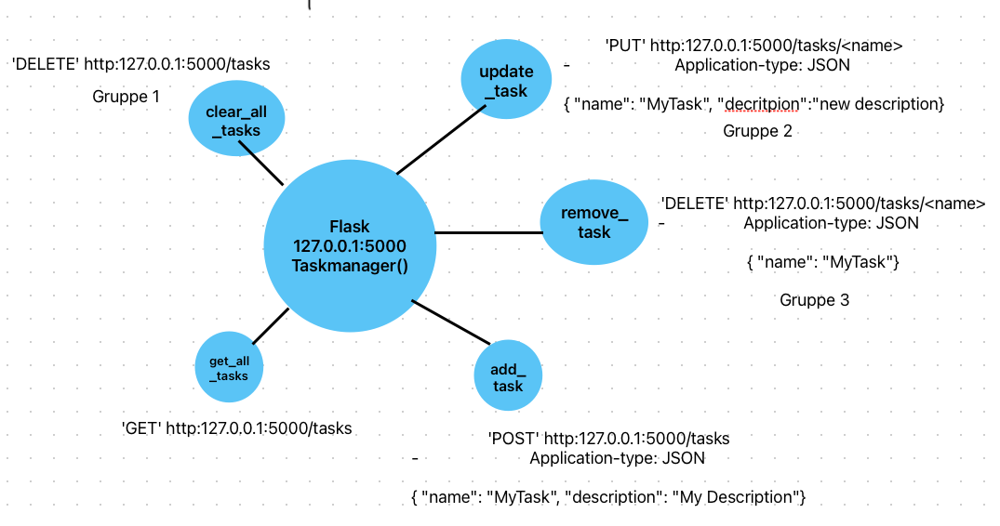

# Task Manager API

A simple REST API for managing tasks using Flask. This API allows you to create, retrieve, update, and delete tasks.

## Features

- Add new tasks
- Retrieve all tasks
- Update existing tasks
- Delete tasks
- Clear all tasks



## Usage

1. **Run the Flask API:**

   ```bash
   python taskmanager/app/api.py
   ```

   The API will be available at `http://127.0.0.1:5000`.

2. **Interact with the API using tools like Postman or curl.**

## API Endpoints

- **GET /tasks**
  - Returns all tasks.

- **POST /tasks**
  - Adds a new task.
  - **Request Body:**
    ```json
    {
      "name": "Task Name",
      "description": "Task Description"
    }
    ```

- **DELETE /tasks/<task_id>**
  - Removes a task by its index.

- **PUT /tasks/<task_id>**
  - Updates a task by its index.
  - **Request Body:**
    ```json
    {
      "name": "Updated Task Name",
      "description": "Updated Task Description"
    }
    ```

- **DELETE /tasks**
  - Clears all tasks.

## Testing

You can use tools like [Postman](https://www.postman.com/) or [curl](https://curl.se/) (only in Linux terminal such as WSL), [Insomnia](https://insomnia.rest/), a browser extesion such as [Talend API Designer](https://www.talend.com/products/talend-api-designer/) to test the API endpoints.
During our session we used Talend.

The following examples are based on [curl](https://curl.se/) (only in Linux terminal such as WSL).

1. Get all tasks:

   ```bash
   curl http://127.0.0.1:5000/tasks
   ```

2. Add a task:

   ```bash
   curl -X POST -H "Content-Type: application/json" -d '{"name": "Task Name", "description": "Task Description"}' http://127.0.0.1:5000/tasks
   ```

3. Remove a task:

   ```bash
   curl -X DELETE http://127.0.0.1:5000/tasks/0
   ```

4. Update a task:

   ```bash
   curl -X PUT -H "Content-Type: application/json" -d '{"name": "Updated Task Name", "description": "Updated Task Description"}' http://127.0.0.1:5000/tasks/0
   ```

5. Clear all tasks:

   ```bash
   curl -X DELETE http://127.0.0.1:5000/tasks
   ```
